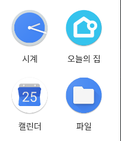
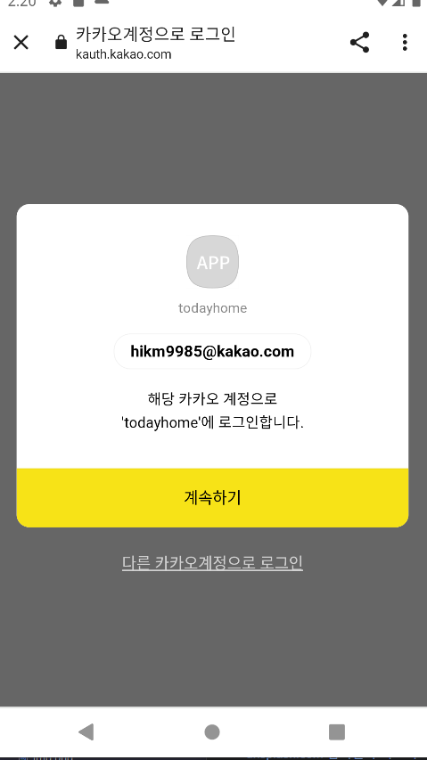
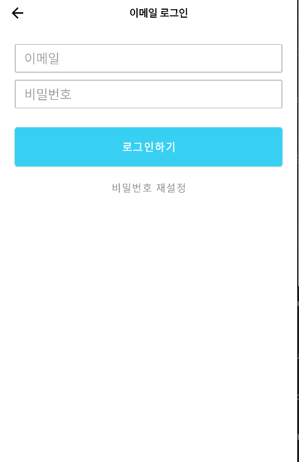
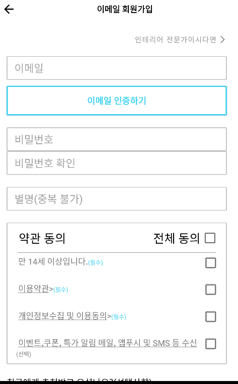
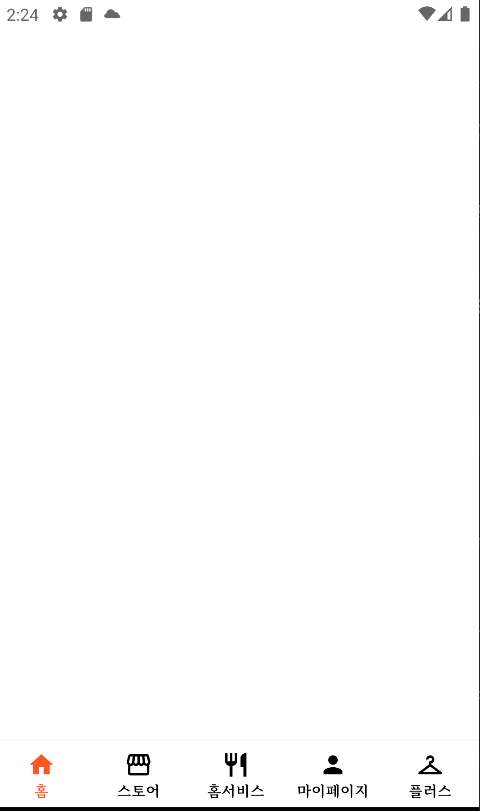

# todayhome
오늘의 집 (완성률 : 0%)

📌6월 25일 개발 일지

📌6월 25일 개발 일지

1. 앱 아이콘 모두의 집으로 변경

2. 소셜 로그인 완료(카카오 API)

3. 로그인 페이지 UI 99% (약간 다듬어야 합니다.)

4. 이메일 로그인, 이메일로 가입 레이아웃 80% (이메일 + 비밀번호 다 입력했을 때 로그인하기 버튼 이벤트 구현해야 합니다. )

5. 비회원 주문조회하기 레이아웃 구현 90% (버튼만 넣으면 됩니다.)

6. 바텀네비게이션 20% ( Fragment 5개 추가를 하였고 4개는 (홈, 스토어, 홈서비스,마이페이지), 1개는 + 버튼인데 클릭하면 아래에서 위로 올라오는 데 구현해보지 않아서 내일 구현해야 할 거 같습니다. )

7. splash 화면 구현(크기 조절 필요)

